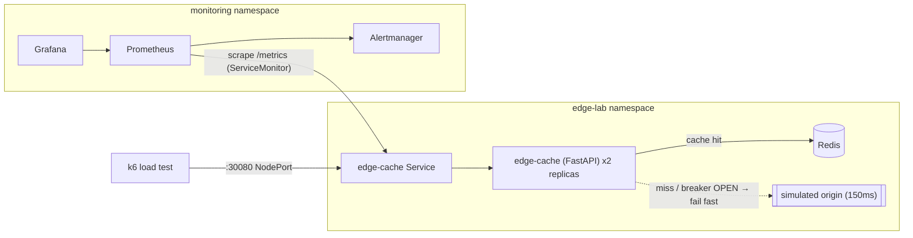
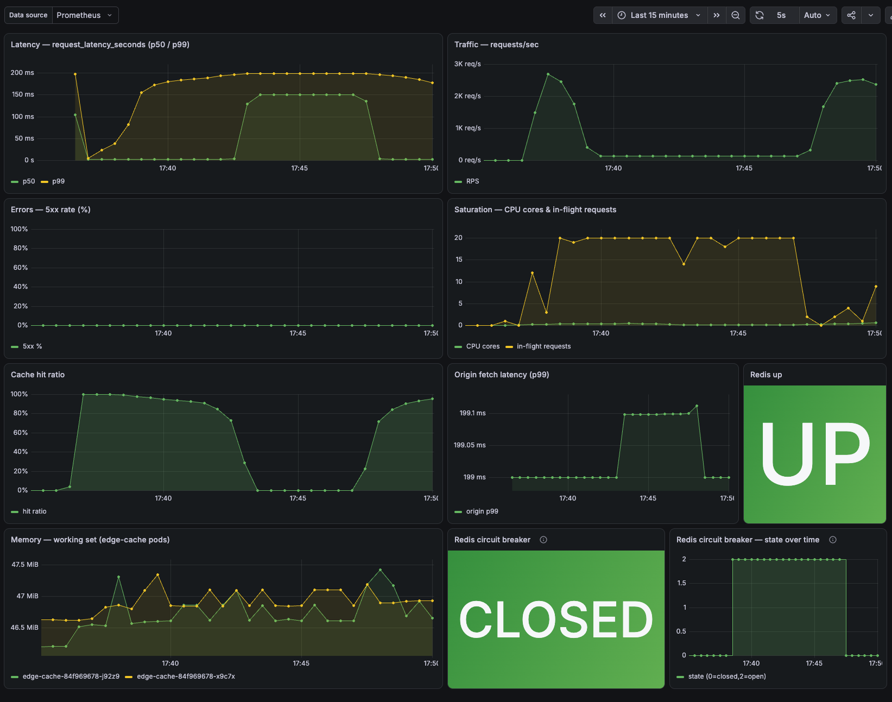
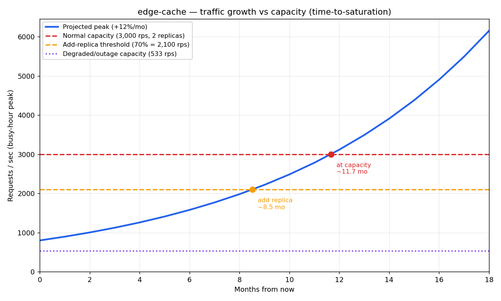

# Edge Reliability Lab


An edge video-cache service and the operational stack around it: a Kubernetes
deployment, Prometheus/Grafana monitoring, SLOs with burn-rate alerting, a
load-and-chaos test harness, and Terraform + CI to rebuild the whole thing. I built it
to practise site reliability engineering on something concrete — to define what
"reliable" means for a cache, measure it, then deliberately break the service under load
and work the incident through to a post-mortem and fixes.

The parts I learned the most from weren't the happy path. They were two failures I hit
while trying to break the service *cleanly*: a synchronous request handler that stalled
on a dead Redis instead of failing fast, and an operational alert that was too slow to
fire on a short outage. Both are diagnosed, fixed, and written up here.

## Contents

- [What it does](#what-it-does)
- [Architecture](#architecture)
- [How a request flows](#how-a-request-flows)
- [The circuit breaker](#the-circuit-breaker)
- [Observability](#observability)
- [SLOs, error budgets, and alerting](#slos-error-budgets-and-alerting)
- [The incident](#the-incident)
- [Capacity planning](#capacity-planning)
- [Running it locally](#running-it-locally)
- [Infrastructure as code](#infrastructure-as-code)
- [Tests and CI](#tests-and-ci)
- [Design decisions worth calling out](#design-decisions-worth-calling-out)
- [Project structure](#project-structure)
- [Possible next steps](#possible-next-steps)

## What it does

`edge-cache` is a small stand-in for an edge node in a video-delivery network. Clients
ask for video "segments" by ID; the service returns them from a Redis cache when it can,
and falls back to a simulated origin (a fixed latency penalty) on a miss, caching the
result so the next request for that segment is fast. It's deliberately simple so the
*operational* concerns — latency under load, cache-hit ratio, what happens when a
dependency dies — stay in the foreground.

Everything is instrumented for Prometheus, deployed to a local Kubernetes cluster
(`kind`), and governed by explicit SLOs. There's a runtime chaos lever for injecting
faults, a k6 load test, and a scripted incident that scales Redis to zero under load so
the failure and recovery can be observed on the dashboard.

## Architecture



Two `edge-cache` replicas sit behind a ClusterIP Service; a separate NodePort Service
exposes port 30080 for the load test so traffic goes through kube-proxy rather than a
`kubectl port-forward` tunnel (which fell over above ~1k req/s in early testing).
Prometheus discovers the service through a ServiceMonitor and scrapes `/metrics`; Grafana
reads from Prometheus; the dashboard itself is provisioned from a labelled ConfigMap that
Grafana's sidecar imports.

## How a request flows

A `GET /segment/{id}` does the following:

1. Check Redis for `segment:{id}`. On a **hit**, return the bytes immediately and record
   a cache hit.
2. On a **miss**, sleep for the configured origin latency (default 150 ms) to simulate
   fetching from a far origin, generate the segment bytes, write them back to Redis with
   a TTL, and record a miss plus the origin-fetch latency.

Redis is treated as a hard dependency in the cluster (`CACHE_MEMORY_FALLBACK=false`).
This is a deliberate choice: an earlier version silently fell back to an in-process dict
when Redis was unreachable, which meant a Redis outage was completely invisible — latency
and hit ratio looked fine because the app was quietly serving from local memory. Making
Redis a real dependency means an outage actually shows up in the metrics, which is the
whole point of the chaos experiment. (The in-memory fallback still exists for unit tests,
so the suite runs without a Redis server.)

`/segment` is a synchronous handler, so each request runs on a worker thread from
FastAPI's thread pool. `/healthz` and `/metrics` are async, so they run on the event loop
and stay responsive even when every worker thread is busy — a health check must not be
starved by the very load or outage it's meant to report on. `/healthz` also reports the
*last observed* Redis health rather than doing a live ping, because an early version's
live ping in the readiness probe turned a Redis blip into a full correlated outage:
Kubernetes marked every replica unhealthy and pulled them all from service at once.

## The circuit breaker

When Redis goes down, the naive behaviour is for every request to try Redis, wait for the
connection to time out, and only then fall through to origin. Because `/segment` is
synchronous, each of those requests holds a worker thread for the duration. Under load the
thread pool fills with requests all blocked on the same dead dependency, throughput
collapses, and — the subtle part — the cache hit/miss counters stop advancing, so the
alert that watches the hit ratio never gets the data it needs to fire. The outage makes
itself *less* visible, not more. (This is exactly the bug the incident below uncovered.)

The fix is a circuit breaker around the Redis calls:

- **Closed** (normal): calls go to Redis as usual.
- **Open**: after 3 consecutive failures the breaker opens and, for a cooldown window
  (default 5 s), requests skip Redis entirely and go straight to origin. Worker threads
  are freed, throughput holds, and the hit ratio collapses cleanly — which is what lets
  the alert fire.
- **Half-open**: once the cooldown elapses, a single probe request is allowed through. If
  it succeeds, the breaker closes and normal caching resumes; if it fails, the breaker
  re-opens and the cooldown restarts.

Crucially, an open breaker still reports `redis_up = 0` and exposes its state on the
`redis_circuit_state` gauge, so the outage stays visible on the dashboard and the
`RedisDown` alert still fires. The breaker drops the *stall*, not the *signal*. Its
thresholds are tunable via `REDIS_CB_FAIL_THRESHOLD`, `REDIS_CB_COOLDOWN_SECONDS`, and
`REDIS_CB_ENABLED`.

## Observability

The service exposes these Prometheus metrics on `/metrics`:

| Metric | Type | What it tells you |
|--------|------|-------------------|
| `http_requests_total{route,status}` | counter | traffic and error rate (the golden signals: traffic, errors) |
| `request_latency_seconds{route}` | histogram | end-to-end latency; the SLI for the latency SLO |
| `cache_hits_total` / `cache_misses_total` | counter | cache hit ratio |
| `origin_fetch_latency_seconds` | histogram | how slow origin fetches are when the cache misses |
| `inflight_requests` | gauge | in-flight concurrency (a saturation signal) |
| `redis_up` | gauge | 1 if the last Redis op succeeded, 0 if it failed |
| `redis_errors_total` | counter | count of failed Redis operations |
| `redis_circuit_state` | gauge | breaker state: 0 closed, 1 half-open, 2 open |
| `chaos_*` | gauge | reflects the current injected-fault state, so the dashboard shows exactly when the lab was perturbed |

The Grafana dashboard lays these out as the four golden signals (latency, traffic,
errors, saturation) plus cache hit ratio, origin latency, Redis health, and the circuit
breaker state.



## SLOs, error budgets, and alerting

The SLOs are defined on the user-facing `GET /segment/{id}` endpoint (health and admin
routes are excluded). Full reasoning is in [docs/SLO.md](docs/SLO.md).

| SLO | SLI | Target | Error budget (30 days) |
|-----|-----|--------|------------------------|
| **Availability** | proportion of `/segment` requests that return non-5xx | 99.9% | 0.1% (~43 min equivalent) |
| **Latency** | proportion of `/segment` requests served in < 200 ms | 99% | 1% |

Latency is measured as the fraction of requests landing in the `le="0.2"` histogram
bucket rather than a raw p99 line, because a "proportion of good requests" composes
cleanly into an error budget.

Alerting uses two complementary styles:

- **Multi-window, multi-burn-rate** alerts on the SLOs (from the Google SRE workbook).
  A page fires when the error budget is burning at 14.4× over *both* a 1-hour and a
  5-minute window; a ticket fires at 6× over 6 hours and 30 minutes. Requiring a long and
  a short window to agree gives fast detection without flapping on every blip.
- **Fast operational alerts** — `RedisDown`, `HitRatioCollapsed`, `ServiceDown` — for
  sharp failures that a slow burn-rate window would miss. `HitRatioCollapsed` uses a
  2-minute window with a 2-minute hold, deliberately faster than the burn-rate alerts,
  because a cache outage needs catching in minutes, not hours.

Every alert links to a [runbook](docs/runbooks/) with first checks, likely causes,
mitigation, and how to confirm recovery.

## The incident

The chaos experiment: with steady load from k6, scale Redis to zero, hold the fault for
nine minutes, then restore it and watch recovery. Times below are from one real run
(full write-up and screenshots in
[docs/postmortems/2026-07-01-redis-cache-outage.md](docs/postmortems/2026-07-01-redis-cache-outage.md)).

| | Baseline | During the outage |
|---|----------|-------------------|
| Cache hit ratio | ~95% | ~0% |
| Latency (p50 / p99) | a few ms | ~150 ms / ~199 ms |
| Throughput | steady | held at ~128 req/s |
| Errors (5xx) | 0 | 0 |
| `redis_up` | 1 | 0 |

Every request still returned `200` — the failure mode of a cache is latency, not errors —
so this was graceful, visible degradation. `RedisDown` fired about a minute in;
`HitRatioCollapsed` fired about four minutes in; both cleared on recovery.

Getting to that clean result took two fixes, and they're the most useful part of the
project:

- **The service stalled instead of degrading.** On the first run, throughput fell to zero
  and `HitRatioCollapsed` never fired, because the synchronous handler blocked every
  worker thread on the dead Redis connection (see [the circuit breaker](#the-circuit-breaker)).
  The breaker fixed it: on the next run the service held ~128 req/s and served ~69,000
  origin misses through the fault, versus roughly zero before.
- **The alert was too slow.** Even with the stall fixed, `HitRatioCollapsed` only reached
  `PENDING`. Its 5-minute averaging window meant the hit ratio didn't cross 50% until ~5
  minutes into a 9-minute fault, and the extra 5-minute hold couldn't complete before
  Redis came back. Retuning it to a 2-minute window and 2-minute hold made it fire at ~4
  minutes, with margin to spare.

A debugging note I want to remember from this: a Grafana panel on a 3,000-rps axis made
~128 req/s look like zero, which nearly sent me chasing a stall that no longer existed.
The `cache_misses_total` counter — up by 69,000 during the fault — told the real story.
Trust the counters over the eyeballed graph.

## Capacity planning

[docs/capacity/CAPACITY.md](docs/capacity/CAPACITY.md) models how much traffic the service
can take before it breaches the latency SLO, in both normal and degraded modes, and
forecasts when growth will require more replicas. Run `docs/capacity/capacity_forecast.py`
to reproduce the chart; the inputs are labelled so real load-step measurements can replace
the modelled ones.



The result that ties back to the incident: normal capacity is CPU-bound at roughly 3,000
req/s across two replicas, but *degraded* capacity is only ~530 req/s. During a Redis
outage every request becomes a 150 ms origin fetch that holds a worker thread, so a
replica sustains far less. The circuit breaker is what makes this a finite, plannable
number instead of "zero, because everything stalls" — which means surviving an outage at
peak traffic, not serving normal traffic, is the binding constraint on how many replicas
"enough" really is.

## Running it locally

**Prerequisites:** Docker, plus `kind`, `kubectl`, `helm`, `k6`
(`brew install kind kubectl helm k6`) and `terraform` (from the HashiCorp tap).

```bash
# 1. Create the kind cluster and load the app image into it
bash scripts/setup.sh
bash scripts/build-and-load.sh

# 2. Bring up everything in-cluster (Helm release + app + Redis + dashboard)
cd terraform && terraform init && terraform apply && cd ..

# 3. Generate some traffic and open the dashboard
bash scripts/generate-traffic.sh
kubectl -n monitoring port-forward svc/kube-prom-stack-grafana 3000:80
```

Grafana is at http://localhost:3000 (admin / admin) — open **"Edge Cache — Golden Signals
+ Cache"**. Within a minute the hit-ratio panel should climb toward ~95% and the circuit
breaker tile should read CLOSED.

**To run the incident yourself:** start the load test (`k6 run load/k6-loadtest.js`), have
Grafana open, then run `bash scripts/run-incident.sh`. It scales Redis to zero, holds the
fault, restores it, and writes a timestamped timeline to `docs/postmortems/`. Watch the
Redis-up tile flip to DOWN, the breaker open, the hit ratio collapse, and the two alerts
fire — then recover when Redis comes back.

## Infrastructure as code

`terraform/` makes the in-cluster state reproducible: `terraform apply` installs the
kube-prometheus-stack Helm release, applies the app manifests, and provisions the Grafana
dashboard. It uses a pragmatic split — the `kind` cluster and the image build stay in the
setup scripts (creating a cluster from Terraform is flakier and harder to demo), while
everything inside the cluster is managed by Terraform. The Kubernetes manifests in `k8s/`
stay the single source of truth; Terraform applies them via the `kubectl` provider rather
than re-declaring them as HCL, so there's no duplication or drift. Details and the
teardown/rebuild flow are in [terraform/README.md](terraform/README.md).

## Tests and CI

`app/tests/` covers the cache hit/miss logic, the chaos endpoints, and the circuit breaker
(open-after-threshold, skip-while-open, half-open recovery). The suite is hermetic — it
uses the in-memory cache backend and a fake Redis, so it needs no running services and is
order-independent.

GitHub Actions ([.github/workflows/ci.yml](.github/workflows/ci.yml)) runs on every push
and pull request: lint with ruff, run the tests with pytest, and build the Docker image.

## Design decisions worth calling out

- **Redis is a hard dependency, not a silent fallback.** Visibility of the outage was
  worth more than papering over it with local memory.
- **Health checks don't depend on Redis.** `/healthz` reports last-observed health and
  never blocks on a live ping, so a dependency outage can't cascade into a correlated
  pod-eviction outage.
- **The breaker preserves the signal.** An open breaker still reports the outage; it only
  removes the thread-stalling behaviour, not the observability.
- **Operational alerts and SLO burn-rate alerts use different windows on purpose** — fast
  and short for "on fire now", long and slow for "the budget is bleeding".

## Project structure

| Path | Contents |
|------|----------|
| `app/` | FastAPI service — cache layer, circuit breaker, chaos lever, metrics — and tests |
| `k8s/` | Kubernetes manifests (app, Redis, ServiceMonitor, SLO rules) + kind and monitoring config |
| `dashboards/` | Grafana dashboard JSON |
| `docs/SLO.md` | SLOs, error budgets, and the alerting rationale |
| `docs/runbooks/` | One runbook per alert |
| `docs/postmortems/` | The incident post-mortem, timeline, and screenshots |
| `docs/capacity/` | Capacity model, forecast script, and chart |
| `docs/CASE_STUDY.md` | Narrative write-up of the whole project |
| `load/` | k6 load test |
| `terraform/` | Terraform for the in-cluster stack |
| `scripts/` | setup / build-load / deploy / incident / teardown helpers |

## Possible next steps

These come out of the post-mortem's action items:

- A short-TTL in-process micro-cache for the hottest keys, to blunt an origin miss-storm
  during a Redis outage without hiding the outage from the metrics.
- An origin-request-rate panel and alert, to catch origin overload directly rather than
  inferring it from the hit ratio.
- A Redis PodDisruptionBudget / multi-replica setup so losing a single pod isn't a full
  cache outage.
