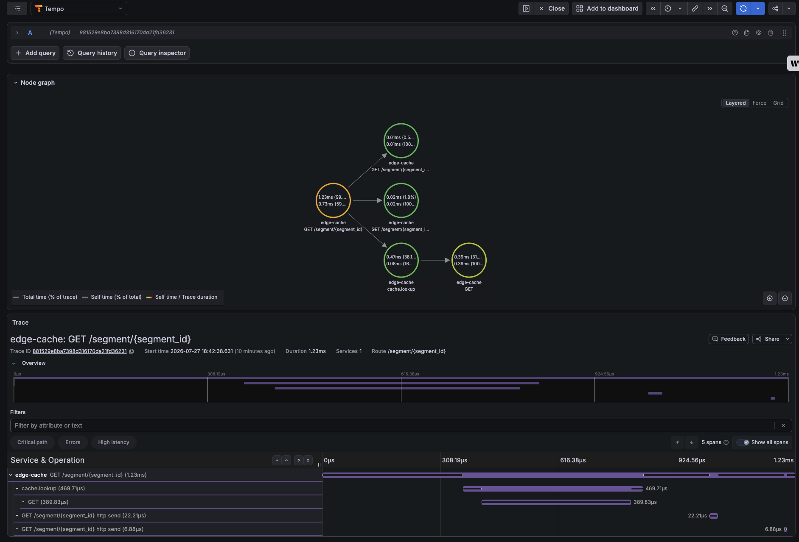
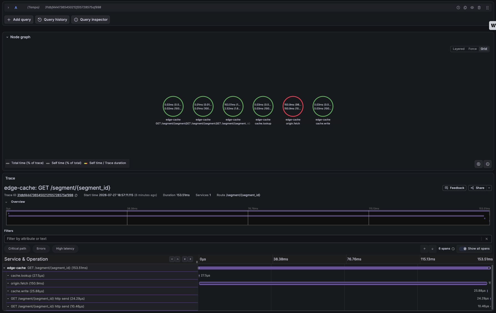
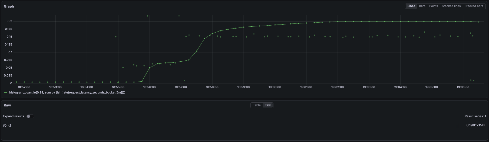
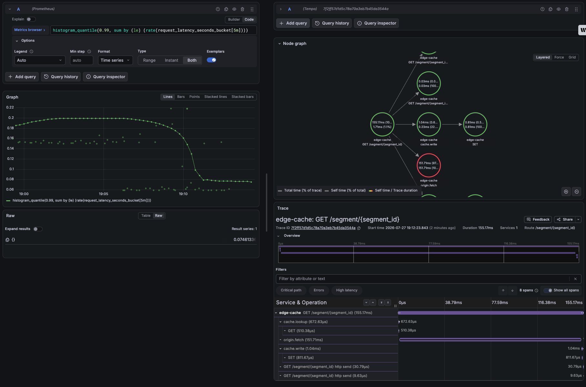

# Distributed tracing

Metrics say *that* the service is slow. Traces say *where the time went* inside one
request. This is the third observability pillar in the lab, alongside the Prometheus
metrics and the SLO/alerting work.

## What a trace looks like here

A single `/segment` request breaks into a waterfall:

```
GET /segment/abc123                          812ms
├── cache.lookup                              11ms   cache.hit=false  redis.circuit_state=closed
└── origin.fetch                             798ms   origin.fetch_seconds=0.798
```

On a cache hit the shape is completely different — `origin.fetch` doesn't exist at
all, and the request finishes in single-digit milliseconds. That difference is the
diagnosis, visible without reading a line of code.



The same view during the Redis outage, where the interesting detail is what is
*absent* — no Redis `GET` under `cache.lookup`, no `SET` under `cache.write`:



## Why it earns its place

The lab already had metrics and alerts. Tracing was added because those two answer
different questions:

| Question | Answered by |
|---|---|
| Is the service breaching its SLO right now? | Metrics + alerts |
| How often do we miss cache? | Metrics |
| Why was *this particular* request slow? | **Traces** |
| Which leg of the request consumed the latency? | **Traces** |

During the Redis outage drill the trace shape changes in a way that proves the
circuit breaker is doing its job: once the breaker opens, `cache.lookup` collapses
to near-zero and carries `redis.skipped=true`, and every request goes straight to
`origin.fetch`. The service is degraded but not stalled — and you can see it rather
than infer it from a gauge.

## Architecture

```
edge-cache (FastAPI)
   │  OpenTelemetry SDK, OTLP/HTTP
   ▼
Tempo :4318            ← trace storage
   │
   ▼
Grafana  ──── Prometheus :9090 ← metrics (exemplars carry trace ids)
```

Grafana renders both, so the metric-to-trace jump happens in one place.

## Design decisions

**Tracing is opt-in and inert by default.** With `OTEL_EXPORTER_OTLP_ENDPOINT`
unset, `app/tracing.py` configures nothing and `start_span()` returns a null span.
Tests, a bare `docker compose` and a fresh clone all work with no collector. The
tooling that observes the service must never become a dependency of it.

**Sampled at 10% in the cluster.** The incident drill sustains ~128 rps. Exporting
every span adds work to the request path and would skew the very p99 the drill
measures. `TRACE_SAMPLE_RATIO` controls it; local compose runs at 1.0 because there
is no load to distort and you want the request you just made.

**`ParentBased(TraceIdRatioBased)`** rather than a flat sampler, so a sampling
decision made upstream is honoured and traces are never half-recorded.

**`/healthz` and `/metrics` are excluded.** Probes fire every few seconds per
replica and Prometheus scrapes every 10s. Tracing them would swamp the backend with
spans that diagnose nothing.

**Batched export on a background thread.** A slow or dead Tempo drops spans; it
never blocks a request. Losing telemetry is acceptable, losing availability is not.

**Tempo is a separate Helm release, not a subchart.** Traces have a different
storage and retention profile from metrics, and keeping them apart means Tempo can
be restarted, resized or removed without touching Prometheus.

## Exemplars: the metric-to-trace jump

An exemplar is a trace id attached to a single histogram observation. In Grafana it
renders as a small diamond on the latency panel — click it, land on that exact
request's trace.





Three things must line up, and if any one is missing it fails **silently**:

1. **The app must attach it.** `_observe()` in `app/main.py` passes
   `exemplar={"trace_id": ...}` when a trace is in flight.
2. **`/metrics` must serve OpenMetrics.** Exemplars do not exist in the classic
   Prometheus text format. The endpoint content-negotiates: Prometheus sends
   `Accept: application/openmetrics-text` and gets exemplars; anything else gets
   the plain format and never knows the difference.
3. **Prometheus must store them.** `enableFeatures: [exemplar-storage]` in
   `k8s/monitoring-values.yaml`. Without it Prometheus parses exemplars and throws
   them away.

If the diamonds don't appear, check those three in that order.

### The sampling trap

There is a fourth requirement that only bites once sampling is on, and it was a
real bug here before it was a paragraph.

An **unsampled span still has a valid trace id** — it simply never gets exported.
If you attach that id as an exemplar, Grafana renders a perfectly normal diamond,
you click it, and Tempo answers `failed to get trace with id ... Status: Not
Found`. At a 10% sample ratio roughly nine out of ten exemplars behave this way.

`current_trace_id()` therefore checks `ctx.trace_flags.sampled` before returning
anything. The panel shows fewer diamonds; every one of them resolves.

The general lesson is worth more than the fix: a link that looks right and goes
nowhere is more damaging than no link at all, because it trains people to stop
trusting the tooling during exactly the incident where they need it.

## Running it

**Locally:**

```bash
docker compose up --build
curl localhost:8000/segment/abc     # MISS — wide origin.fetch span
curl localhost:8000/segment/abc     # HIT  — no origin.fetch span at all
```

**In the cluster:** `scripts/install-monitoring.sh` installs Tempo alongside the
kube-prometheus-stack, or `terraform apply` brings up the whole thing including the
Tempo release and both Grafana datasources.

```bash
kubectl -n monitoring port-forward svc/kube-prom-stack-grafana 3000:80
# Grafana → Explore → Tempo → Search → service.name = edge-cache
```

## Limitations, stated plainly

- **Single service.** Every span here comes from one process, so this demonstrates
  intra-service tracing. The interesting case in a real system — a trace crossing
  several services via propagated context — isn't exercised, because there is only
  one service to cross.
- **Traces don't survive a restart.** Tempo runs with `persistence: false` on local
  storage. Fine for reviewing a drill within a session; useless as a record.
- **The origin is `time.sleep`.** `origin.fetch` measures a simulated delay, not a
  network call, so the span is honest about its own duration but the workload
  behind it is synthetic.
