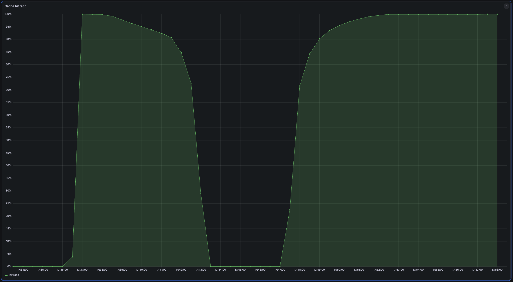
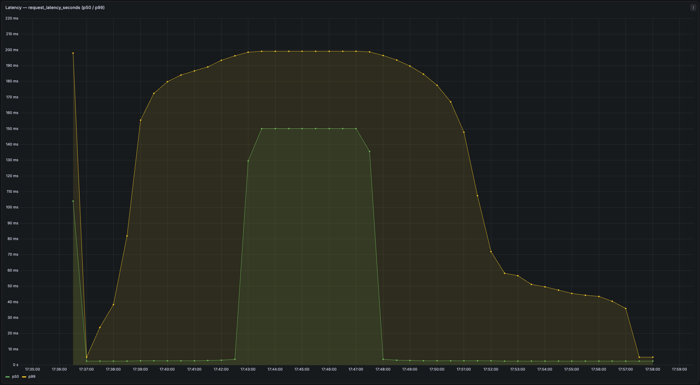
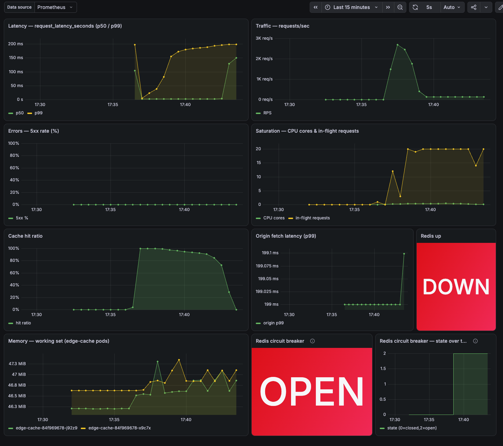

# Post-mortem — Edge-cache Redis outage (cold-cache / origin overload)

> **Blameless post-mortem.** The goal is to understand *what* happened and *why the
> system allowed it*, and to make the system more resilient — not to attribute fault
> to any person. This was a **planned chaos experiment** in the lab, written up exactly
> as a production incident would be.

| | |
|---|---|
| **Status** | Resolved |
| **Severity** | SEV-2 (major degradation, no data loss) |
| **Date** | 2026-07-02 (verified chaos re-run; initial experiment 2026-07-01) |
| **Authors** | Dawod Ghifari |
| **Services affected** | `edge-cache` (video segment delivery) |
| **Trigger** | Redis (cache layer) scaled to 0 replicas under load |
| **Duration of impact** | ~9 min (fault 17:38:07 → mitigation 17:47:07; fully recovered by 17:49:44 AEST) |

---

## 1. Summary

While the `edge-cache` service was under steady load (~20 concurrent users via k6), the
Redis cache layer was taken down to 0 replicas. Because the service treats Redis as a
hard dependency (strict mode), every request began missing the cache and falling
through to the simulated origin. The circuit breaker detected the dead dependency within
seconds and opened, so requests failed fast to origin (~150 ms) rather than stalling on
Redis: throughput held at ~128 req/s and ~69,000 misses were served from origin over the
9-minute fault. The cache hit ratio collapsed from ~95% to ~0%, p99 latency rose to
~199 ms (p50 ~150 ms, the pure origin-fetch cost), and `redis_up` dropped to 0.
Availability held — every request still returned `200`, zero 5xx — so this was graceful,
*visible* degradation, not an outage. Both operational alerts fired as designed. The
incident was mitigated by restoring Redis; the cache re-warmed and metrics returned to
normal with no app restart.

## 2. Impact

- **User-facing:** slower segment delivery for the duration (every request an origin
  fetch), but still successful — no errors (no 5xx), no data loss.
- **Cache hit ratio:** ~95% → ~0%.

  

- **Latency:** p99 ~5 ms (warm cache) → **~199 ms**; p50 rose to **~150 ms**, i.e. the pure
  origin-fetch cost with no Redis timeout stacked on top (breaker skipped the dead call).

  

- **Throughput / degradation shape:** held **~128 req/s** with **~69,000 origin misses**
  over the fault — degradation was graceful, not a throughput collapse.
- **Redis availability:** `redis_up` = 0 for ~9 min; `redis_circuit_state` = 2 (open) for
  the same window.

  

- **Error budget:** availability budget essentially untouched (no 5xx). Latency budget
  burned during the window — see §7.

## 3. Detection

The incident was detected automatically by alerting (no human noticed it first):

| Alert | Fired after | How it detected the problem |
|-------|-------------|-----------------------------|
| `EdgeCacheRedisDown` | ~1 min | `redis_up == 0` — the app reported it could not reach Redis |
| `EdgeCacheHitRatioCollapsed` | ~4 min | hit ratio < 50% under real traffic (2m window + `for:2m`; see action item #6) |

Both alerts observed firing via the Prometheus rules API at 17:42:12 (the moment
`HitRatioCollapsed` promoted from `PENDING`):

```
17:42:12
FIRING   EdgeCacheRedisDown
FIRING   EdgeCacheHitRatioCollapsed
INACTIVE EdgeCacheServiceDown
INACTIVE EdgeCacheAvailabilityFastBurn
INACTIVE EdgeCacheAvailabilitySlowBurn
INACTIVE EdgeCacheLatencyFastBurn
INACTIVE EdgeCacheLatencySlowBurn
```

> Note: the dashboard **hit-ratio and latency panels use a 5-minute rate window**, so they
> visibly lag the event by a few minutes (the hit-ratio panel doesn't bottom out until
> ~17:43). `HitRatioCollapsed` uses a faster **2-minute** window, which is why it fires
> at 17:42:12 — before the panel even reaches 0. The alert is deliberately more responsive
> than the eyeball view.

Both alerts link directly to runbooks
([redis-down](../runbooks/edge-cache-redis-down.md),
[hit-ratio-collapsed](../runbooks/edge-cache-hit-ratio-collapsed.md)).

## 4. Root cause

The direct cause was the removal of all Redis replicas. The *system-level* reason the
outage was so impactful: **Redis is a hard dependency with no local fallback in strict
mode**, so a Redis outage converts every cache read into a slow origin fetch. In the
*first* run this was compounded two ways — a **1 s Redis connection timeout** stacked on
every request, plus the worker-thread stall described below — both since resolved (the
timeout cut to 250 ms, and the circuit breaker; action items 1 and 5). In the verified
2026-07-02 run the breaker skips the dead Redis entirely, so each request pays only the
~150 ms origin fetch.

This is intentional design for this lab — an earlier version silently fell back to an
in-process cache, which *hid* Redis outages entirely (see the note in §8). We chose
visibility over silent degradation, and this incident is the trade-off made concrete.

**Secondary finding on re-run — a worker-thread stall (fixed), then an alert-timing gap
(fixed).** A later, cleaner run exposed a second-order failure: `/segment` is a
*synchronous* endpoint, so each request runs on a worker thread. With Redis down, every
request blocked on a dead Redis connection before falling through to origin; worker
threads piled up faster than they drained, throughput collapsed, and the
`cache_hits`/`cache_misses` counters barely advanced. Root fix: a **circuit breaker**
around Redis (action item #5) — once Redis is detected down the app stops calling it and
fails fast to origin, so threads stay free and throughput holds.

This was **verified in the cluster** on the 2026-07-02 re-run: during the 9-minute fault
the service held ~128 req/s and recorded **~69,000 cache misses** (vs ~0 before the
breaker), with `redis_circuit_state` = 2 (open) and `redis_up` = 0 throughout — graceful,
*visible* degradation, exactly as intended.

That re-run then surfaced one last gap: `EdgeCacheHitRatioCollapsed` only reached
**PENDING**, never fired. Not a stall — a **too-slow alert**. Its 5-minute averaging
window meant the hit ratio didn't cross 50% until ~5 min into the fault (the window was
still full of pre-fault hits), and the extra `for: 5m` hold then couldn't complete before
Redis was restored at +9 min. Fixed by making it a fast operational alert: 2-minute
window + `for: 2m` (action item #6), which crosses ~2 min in and fires ~4 min in.

## 5. Resolution & recovery

Redis was scaled back to 1 replica. Once the pod was `Ready`, the app's lazy-reconnect
logic reconnected on the next request (no app restart needed). The cache re-warmed as
traffic repopulated it, the hit ratio climbed back toward baseline, latency normalised,
the circuit breaker closed (`redis_circuit_state` → 0), and both alerts cleared.


## 6. Timeline

All times from `docs/postmortems/incident-*-timeline.txt` (generated by the incident runner).

All times AEST (UTC+10), 2026-07-02.

| Time | Event |
|------|-------|
| ~17:37 | Load steady at ~20 VUs; hit ratio ~95%; all green (baseline) |
| **17:38:07** | **Fault injected** — `redis` scaled to 0 |
| ~17:38:22 | `redis_up` → 0; circuit breaker **opens** (state → 2); requests fail fast to origin |
| ~17:39:25 | `EdgeCacheRedisDown` fires (`redis_up`==0 for 1m) |
| ~17:40:12 | Hit ratio (2m avg) crosses below 50% |
| **17:42:12** | `EdgeCacheHitRatioCollapsed` fires (~4 min after fault) |
| **17:47:07** | **Mitigation** — `redis` scaled back to 1 |
| 17:47:14 | Redis `Ready`; breaker half-open probe succeeds → **closes**; cache re-warming |
| ~17:49 | Hit ratio recovered ~95%; latency normal; both alerts cleared |
| 17:49:44 | Incident end |

## 7. What did the error budget do?

- **Availability SLO (99.9% non-5xx):** essentially untouched — the service degraded
  gracefully to slow-but-successful responses.
- **Latency SLO (99% < 200ms):** burned during the window, since nearly all requests
  exceeded 200ms once the cache was cold and Redis timeouts were in play.
- **Why no burn-rate *page*?** The multi-window burn alerts use 1h/6h windows on
  purpose (fast detection with few false alarms). A ~9-minute incident doesn't move a
  1-hour window far enough to page. The fast **operational** alerts (`RedisDown`,
  `HitRatioCollapsed`) are what caught this quickly — which is exactly why we have both
  kinds. This is a deliberate detection-speed vs. precision trade-off, not a gap.

## 8. What went well / what didn't / where we got lucky

**Went well**
- Detection was automatic and fast; both alerts linked actionable runbooks.
- The service degraded *gracefully* (no errors), and recovered with no manual app
  intervention thanks to lazy reconnect.

**Didn't go well**
- Latency amplification (first run): a 1s Redis connect timeout stacked on top of the
  origin fetch. Since cut to 250 ms and mooted by the breaker, which skips the dead call
  (action items 1, 5).
- Worker-thread stall (found on re-run): sync `/segment` workers blocked on dead Redis,
  froze throughput, and *suppressed* the `HitRatioCollapsed` alert — the opposite of what
  the design intended. Fixed with a circuit breaker (§4, action item #5).

**Got lucky**
- Single-region, single-origin lab: a real origin could have been overwhelmed by the
  sudden miss storm. We saw origin latency rise but not collapse.

## 9. Action items

| # | Action | Type | Owner | Status |
|---|--------|------|-------|--------|
| 0 | **Decouple `/healthz` from Redis.** The first run of this experiment exposed a worse failure than intended: `/healthz` did a live 1s Redis ping, so when Redis went down the liveness/readiness probes timed out, Kubernetes marked every replica unhealthy and pulled them from service — a full **correlated outage** instead of graceful degradation. Fixed: `/healthz` is now non-blocking and reports the last Redis health observed by request traffic. | Prevent | Dawod | **DONE** |
| 1 | Lower the Redis connect/read timeout (e.g. 250ms) so outages degrade to origin faster instead of stacking 1s timeouts | Mitigate | Dawod | **DONE** — `REDIS_TIMEOUT_SECONDS` defaults to 0.25s in `cache.py`; superseded in practice by #5 (an open breaker skips the call entirely) |
| 2 | Add a short-TTL in-process micro-cache for the hottest keys, to blunt a full origin miss-storm (without hiding Redis health) | Prevent | Dawod | TODO |
| 3 | Add an origin-request-rate panel + alert to catch miss-storm origin overload directly | Detect | Dawod | TODO |
| 4 | Consider a Redis PodDisruptionBudget / 2-replica setup so a single pod loss isn't a full cache outage | Prevent | Dawod | TODO |
| 5 | **Add a circuit breaker around Redis.** During an outage the sync `/segment` workers stalled on the dead dependency, freezing throughput so `HitRatioCollapsed` never fired. The breaker opens after 3 consecutive failures, skips Redis (fail-fast to origin) for a 5s cooldown, then half-open-probes for recovery. Keeps the outage visible (`redis_up`=0) and surfaces `redis_circuit_state`. Tunable via `REDIS_CB_FAIL_THRESHOLD` / `REDIS_CB_COOLDOWN_SECONDS` / `REDIS_CB_ENABLED`. Verified in-cluster: ~128 req/s and ~69k misses held through the fault. | Mitigate | Dawod | **DONE** |
| 6 | **Speed up `EdgeCacheHitRatioCollapsed`.** With the stall fixed, the alert still only reached PENDING because its 5m averaging window + `for:5m` was too slow for a ~9m fault. Retuned to a 2m window + `for:2m` (fast operational alert, distinct from the slow burn-rate SLO alerts). | Detect | Dawod | **DONE** |

## 10. Lessons

A cache is a *dependency*, and its failure mode is latency, not errors — so latency SLIs
and cache-hit-ratio alerts caught this where an availability-only view would have looked
"fine" (still 200s). Making the Redis dependency **visible** (rather than silently
falling back) is what let us detect, explain, and act on the outage.
